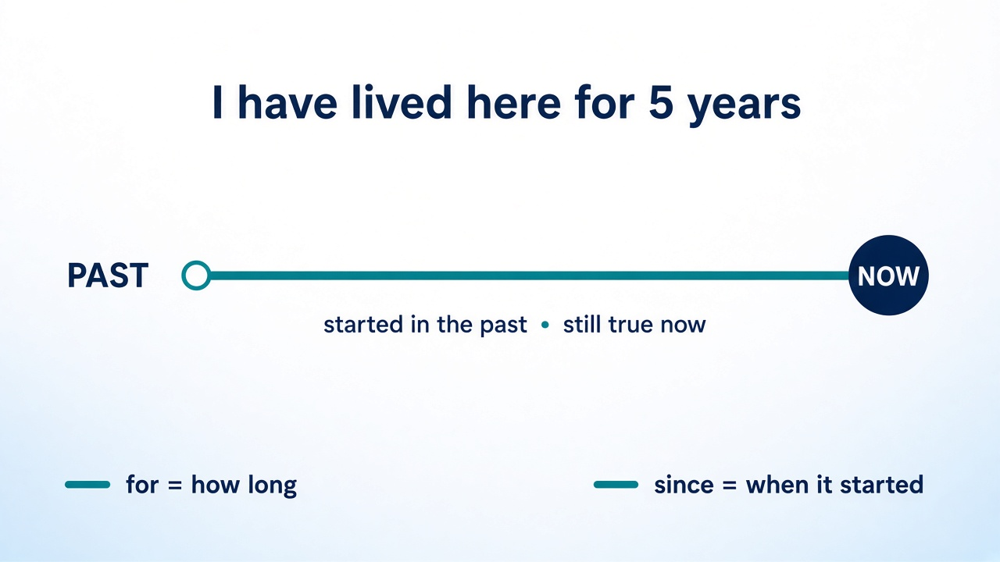
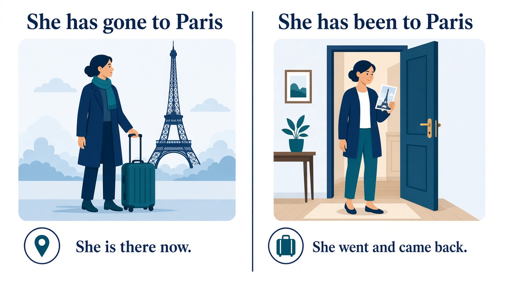

# Present perfect

**Level:** A2–B1  
**Form:** `have` / `has` + past participle  
**Meaning:** a past action connected with **now**. We often do not say the finished time.

| Say this | When the time is |
|---|---|
| I **have visited** Rome. | not given, or still open (`today`, `this week`) |
| I **visited** Rome **in 2019**. | finished (`yesterday`, `last year`, `in 2019`, `ago`) |

Contrast: [past simple](../past-simple/) — add that page when it exists.  
Not this page: present perfect continuous (`I have been waiting`).

## Form

| | Subject | Example |
|---|---|---|
| **+** | I / you / we / they | I **have worked**. / **I've worked**. |
| **+** | he / she / it | She **has worked**. / **She's worked**. |
| **−** | I / you / we / they | I **have not worked**. / I **haven't worked**. |
| **−** | he / she / it | She **has not worked**. / She **hasn't worked**. |
| **?** | I / you / we / they | **Have** you **worked**? |
| **?** | he / she / it | **Has** she **worked**? |

Short answers use only `have` / `has`, not the main verb.

- Have you finished? — **Yes, I have.** / **No, I haven't.**
- Has he called? — **Yes, he has.** / **No, he hasn't.**

The past participle is the third form of the verb.

| Base | Past simple | Past participle |
|---|---|---|
| work | worked | **worked** |
| live | lived | **lived** |
| see | saw | **seen** |
| go | went | **gone** |
| be | was / were | **been** |
| do | did | **done** |
| eat | ate | **eaten** |
| write | wrote | **written** |

Regular verbs: past simple and past participle look the same (`worked`). Irregular verbs often do not (`went` / `gone`).

## When to use it

### 1. Life experience

The time is not important, or we do not know it. `ever` and `never` are typical.

- I **have visited** three countries.
- She **has never eaten** sushi.
- **Have** you **ever flown** in a helicopter?

If the student adds a finished time, change to the past simple: *I visited Japan in 2018.*

### 2. A result you can see now

The action is finished. The important point is the present result.

- **I've lost** my keys. *(I can't open the door now.)*
- She **has broken** her arm. *(It is still broken.)*
- Look — somebody **has eaten** my sandwich.

### 3. Unfinished time

The period is still open: `today`, `this morning`, `this week`, `this year`.

- **I've drunk** three coffees **today**.
- We **haven't seen** Anna **this week**.
- **Has** he **called** you **this morning**?

`This morning` takes the present perfect only while it is still morning. After that morning has finished, use the past simple.

### 4. From the past until now

The situation started in the past and is still true. Ask with **How long…?**

- **I've lived** here **for** five years. *(I still live here.)*
- She **has known** him **since** 2019.
- **How long have** you **worked** at this school?

`for` is a length of time. `since` is the starting point.

| `for` + period | `since` + starting point |
|---|---|
| for two hours | since 2 o'clock |
| for a long time | since Monday |
| for three years | since 2021 |
| for ages | since I was a child |

### 5. Recent news: just, already, yet

In British English these usually take the present perfect.

| Word | Where it goes | Example |
|---|---|---|
| **just** | before the participle | **I've just arrived**. |
| **already** | before the participle, or at the end | She **has already left**. / She **has left already**. |
| **yet** | at the end of questions and negatives | **Have** you **finished yet**? / I **haven't finished yet**. |

`already` means sooner than expected. `yet` means up to now, in a question or a negative.

## been and gone

Both come from `go`, and they do not mean the same thing.

- She **has gone** to Paris. *(She is in Paris now, or on the way.)*
- She **has been** to Paris. *(She went there and came back. She knows the place.)*

## Past simple instead

Use the past simple when the time is finished and named.

| Present perfect | Past simple |
|---|---|
| **I've seen** that film. | I **saw** that film **last night**. |
| **Have** you **ever met** Sara? | **Did** you **meet** Sara **at the party**? |
| **I've lived** here for ten years. | I **lived** in Rome **from 2010 to 2018**. |
| She **has just left**. | She **left** **five minutes ago**. |

Finished time words: `yesterday`, `last week`, `last year`, `in 2019`, `ago`, `when I was a child`, `on Monday` (when that Monday is over).

## Common mistakes

| Learners say | Correct | Why |
|---|---|---|
| I have seen him **yesterday**. | I **saw** him yesterday. | `yesterday` is finished. |
| Have you ever **went** there? | Have you ever **been** there? | After `have`, use the participle. |
| I **live** here since 2019. | **I've lived** here since 2019. | The period continues until now. |
| She **has go** home. | She **has gone** home. | `go` → `gone`. |
| **Do** you know her for long? | **How long have** you **known** her? | `know` is a state from the past until now. |
| I **have been** in London **last year**. | I **was** in London last year. | `last year` is finished. Use `been` only with an open connection to now. |

## Five sentences to read aloud

1. **Have** you **ever lost** your passport?
2. Oh no — **I've left** my phone at home.
3. **We've had** two tests **this month**.
4. Anna **has worked** here **since** March.
5. **I've just finished**, but Ivan **hasn't started yet**.
